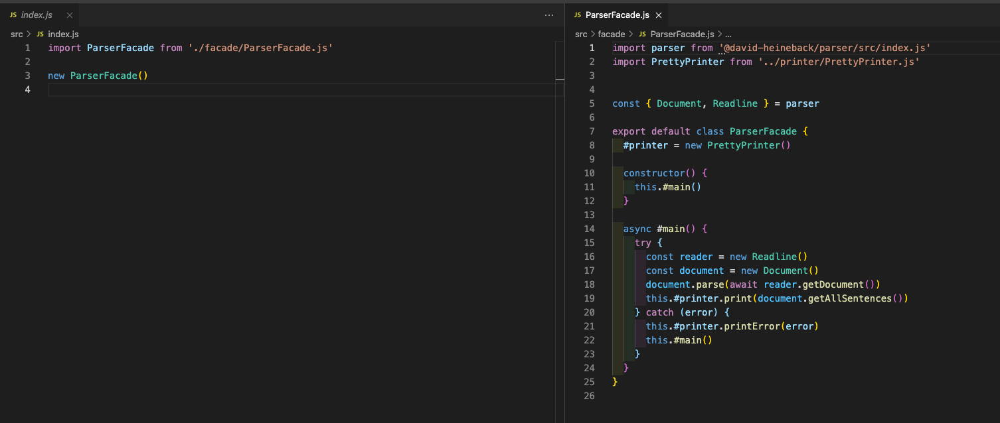
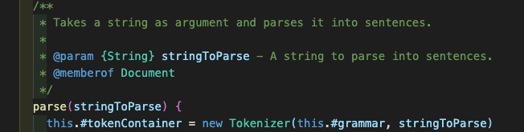

# Mall för inlämning laboration 2, 1dv610

## Checklista
  - [x] Jag har skrivit all kod och reflektioner själv. Jag har inte använt mig av andras kod för att lösa uppgiften.
  - [x] Mina testresultat är skrivna utifrån utförd testning ( och inte teoretiskt, "det bör fungera" :) )
  - [x] De enda statiska metoder eller funktioner utanför klasser som jag har är för att starta upp min testapplikation ex main(java).
  - [x] De enda bibliotek och färdiga klasser som används är sådana som måste användas (eller som används för att testa modulen).

## Egenskattning och mål
  - [ ] Jag är inte klar eftersom jag vet att jag saknar något. Då skall du inte lämna in!
  - [ ] Jag eftersträvar med denna inlämning godkänt betyg (E-D)
    - [ ] De flesta testfall fungerar (enstaka testfall kan misslyckas, tydligt vilka)
    - [ ] Koden är förberedd på återanvändning
    - [ ] All kod samt historik finns i git 
    - [ ] Reflektionerna är skrivna
    - [ ] Koden är läsbar
  - [x] Jag eftersträvar med denna inlämning högre betyg (C) och anser mig uppfylla alla extra krav för detta.  
    -[x] Jag är noga i min testning
    - [x] En del av testfallen är automatiserade (Tokenizer/Parser/PP), viss del kan vara manuellt testad.
    - [x] Det finns en tydlig beskrivning i hur mina moduler skall användas. 
    - [x] Mina reflektioner visar tydligt att jag förstått bokens koncept.
  - [ ] Jag eftersträvar med denna inlämning högsta betyg (A-B) 
    - [ ] Sammanhängande reflektion som ger ett gott helhetsintryck och visar detaljerad förståelse för kodkvalitet.
    - [ ] Min kod är ... (pussar fingrar och gör smackljud)
    - [ ] Extrauppgift parser finns med som egen modul(er)

Förtydligande: Examinator kommer sätta betyg oberoende på vad ni anser. Att ha "saker" från högre betygsnivåer verkar positivt och kan väga upp brister i inlämningen.

## Komponenter och återanvändning
 * Länka in URL om du använder olika repositorier för dina olika komponenter. 
    - [Tokenizer](https://gitlab.lnu.se/1dv610/student/du222aa/l1)
    - [Parser](https://gitlab.lnu.se/1dv610/student/du222aa/l2)
    - [PrettyPrinter](https://github.com/davidheineback/prettyprinter)

 * Beskriv komponenterna och hur de skall användas.
     - [Parser README.md](./README.md)
     - [PrettyPrinter README.md](https://github.com/davidheineback/prettyprinter#readme)  

 * Beskriv hur du anpassat din kod och instruktioner för att någon annan programmerare skall kunna använda dina komponenter. Om du skrivit instruktioner för din användare länka till dessa. Om inte beskriv här hur någon skall göra.  
    - [Parser README.md](./README.md)
    - [PrettyPrinter README.md](https://github.com/davidheineback/prettyprinter#readme)  
    
 * Beskriv hur du säkerhetställt att beroendena mellan komponenterna är som beskrivs i laborationen. 
    - [Tokenizer](https://gitlab.lnu.se/1dv610/student/du222aa/l1) är ett [NPM paket](https://www.npmjs.com/package/@david-heineback/tokenizer) och helt oberoende av koden i [Parser](https://gitlab.lnu.se/1dv610/student/du222aa/l2) & [PrettyPrinter](https://github.com/davidheineback/prettyprinter)
    - Även [Parser](https://gitlab.lnu.se/1dv610/student/du222aa/l2) är ett [NPM paket](https://www.npmjs.com/package/@david-heineback/parser) och parsningen sker i parse metoden på Document klassen och denna testas av de automatiska testerna helt utan att PrettyPrinter är inblandad.
    - [PrettyPrinter](https://github.com/davidheineback/prettyprinter) har beroende av Parser som installeras när man kör npm install.

## Beskrivning av min kod
Klassdiagramet visar en hög abstraktionsnivå av de viktigaste klasserna ock dess relationer.  
Det viktigaste för att parsningen ska fungera är Document-klassen eftersom denna innehåller parse metoden.  
Inne i parse metoden skapar jag en Tokenizer vilket man skulle kunna skicka med som argument via konstruktorn i Document men eftersom jag vill vara den som har kontroll över vilken Tokenizer det är som används så valde jag istället att bygga in denna istället för att lägga den som parameter.  
Klassdiagrammet visar även att beroendet är så som beskrivits i uppgiften.

## Hur jag testat
**Document** klassen med parsening och filtrering av olika typer av meningar är testat via automatiska tester. Se testrapport nedan:

### Testfall  
Tester kan köras via kommandot npm test.  

**PrettyPrinter** är testad manuellt så att färgkodning följer det i beskrivningen. Se resultat nedan:   

## Kapitelreflektioner för kapitel 2-11

### Kapitel 2 - Meaningful names
Precis som i Tokenizer uppgiften har jag försökt följa de riktlinjer som finns i Meaningful names kapitlet. Jag har använder **Pronounceable Names** och hellre långa namn som avslöjar vad en klass/metod förväntas göra.  
Ett par ytterligare reflektioner jag gjort är PrettyPrinter har en sentimental eller historisk blinkning och går där med emot **Don't be cute**. Jag hade hellre bara döpt den till Printer.  
En annan tanke är att klasserna **Sentences** och **Sentence** väldigt lika 
**(Avoid disinformation)**. Men jag har lagt sentence som ett eget paket för att försöka separera de lite mer.  
Ytterligare en klass som först bröt mot **Avoid disinformation** är den som nu heter ParserFacade som finns i prettyprinter. Jag döpte den först till endast Parser men eftersom den kunde blandas ihop med att vara en parser så valde jag att döpa om den även om själva Parsern ligger i sitt eget projekt.  

   

### Kapitel 3 - Functions
Även här har jag tagit hänsyn till **use descriptive names** precis som i kaptiel 2 och i Tokenizer.  
Jag har försökt att hålla alla metoder korta och enkla att följa med i och istället för att ha stora metoder så är det nedbrutet i flera **"Small!"**.  
I största möjliga mån har jag undvikit **switch statements** och endast lagt de i mina "Factory" klasser.  
Mina metoder har väldig få argument, **niladic** eller **monadiac** i princip för samtliga i Parser projektet förutom en metod i Validatorn som ska jämföra två värden vilket gör det naturligt att vi behöver skicka med båda värden som ska jämföras.  
 

### Kapitel 4 - Comments  
**Explain your self with code**. Istället för att använda kommenterar som förklarar vad en kodrad eller ett kodavsnitt gör har jag använt beskrivande namn.

Jag har inga tvingande kommentarer **(Mandated Comments)** utan använder JSDoc kommentarer på de viktagaste publika klasserna och metoderna för att förklara vad de gör **(Javadocs in Nonpublic code)**. Detta gör att jag enkelt undviker **noice comments**.  
Jag har heller ingen kod utkommenterad kodstycken som är obseleta eller tänka att använda senare eller i annan version av programmet **(Commented-Out-Code)**.

 

### Kapitel 5 - Formatting
För de if-satser som innehåller långa rader eller flera villkor så har jag valt att lägga det som en egen metod istället så att koden ska bli mer lättläst **(Horizontal Formatting)**. 

  

Jag har även försökt följa **Vertical Density** så att kod som hör ihop hamnar nära varandra. Om vi kollar på Documentklassen så ligger de privata metoderna som används för kontroller tillsammans och de publika metoderna som ska användas utav en användare tillsammans.

**Vertical openness** tycker jag kommer med på köpet efter som jag följer de riktlinjer som finns Functions kapitlet och även **"Each group of lines represents a expression"** eftersom att varje metod oftast representerar ett uttryck.  
Jag har även tomma rader mellan varje metod.  
 

### Kapitel 6 - Objects and Data Structures
Jag använder mig av privata attribut och metoder i så lång utsträckning som jag kan för att hålla en **hög abstraktionsnivå**. I PrettyPrinter har jag även lagt en fasad klass som är till för att dölja de mer komplexa delarna för användaren. 

  

   

För att undvika **Law of demeter** och medföljande **train wrecks** har jag metoder som har samma namn men ligger i olika klasser. Från början kallade jag bara på getAllSentences i Document och därefter kedjade på den filtreringsmetod som jag ville använda från Sentences objektet. 

Jag hade även en tanke om att endast ha en filtrerings metod i Sentences som kunde ta emot en typ som argument och sedan filtrera på typen men kände ganska snabbt att om jag lägger till ytterligare en meningstyp t.ex. "SuperExclamation" som är att en mening avslutas med !!! så vill jag kanske kunna filtrera ut den tillsammans med de vanliga Exclamations och då blev det betydligt mycket bättre att göra som jag har nu och bara kunna lägga till det i filtreringen istället för att ändra flera attribut och att det inbland kan skickas in ett "undefined" som typ.
 

### Kapitel 7 - Error Handling
Jag använder endast try/catch i PrettyPrinter och den kommer fånga de undantag som kastas både från Parser och från Tokenizer och visa som error. Eventuellt bör jag omslutit även Tokenizeringen inne i Parsern med try/catch men eftersom det är ytterligare ett lager som ska till för att utnyttja Parsern så tycker jag att det är upp till användaren att hantera alla de undantag som kastas.  
Om ett fel kastas till PrettyPrinter så skrivs felmeddelandet ut och användaren får möjlighet att skriva en ny sträng istället för att programmet crashar.

  

Jag funderade över **Provide Context with Exceptions** då jag inte delger någon speciell kontext till mina fel däremot så kastar jag endast fel då användaren skickat in någon felaktig information och jag skriver ut vad det är som är fel vilket på sitt sätt ger en kontext till användaren vad som är fel.  

  

 

### Kapitel 8 - Boundaries
**Using Third-Party Code** Jag använder mig av min egen Tokenizer vilken skulle kunna ses som en tredje part men eftersom jag inte använder Dependecy injection för att få en Tokenizer i min Document.parse metod så har jag kontroll över vilken Tokenizer som används och dess förväntade funktionalitet.  

  

Men även att jag har kontrollen över den så har jag lagt det som ett npm paket vilket gör att om jag uppdaterar paketet för Tokenzier utan att tänka på det i Parser så kan det vara så att min Parser använder en gammal och eventuellt buggig version av min Tokenizer.   

 

**Learning (Tests)** Jag har inte skrivit några separata tester för tredje parts moduler men jag fick testa mycket manuellt för den i Node.js inbyggda modulen readline för att få den att fungera och förstå att den var asynkron och att jag behövde skapa ett Promise och sedan returnera det med resolve som finns på Promise metoden.  

 

### Kapitel 9 - Unit Tests
Jag har skrivit automatiska tester och jag började med en **Test Driven Developement** approach och skrev ett antal tester för de saker som jag visste att jag behövde t.ex. Document.parse.  
Men sedan allteftersom så blev det mer att jag behövde utöka och refaktorera koden och då skrev jag istället testerna efter att den ursprungliga versionen av koden var skriven och sedan fick jag refaktorera koden igen tills dess att jag passerade mina tester.  
Jag har försökt använda beskrivande namn på testfallen och varje enskilt test är oftast bara en rad och innehåller endast en assert **(Clean test & One Assert per test)**  

  

Samtliga tester är skrivna med **F.I.R.S.T**   

**Fast**: De är små och exekveras snabbt.  

**Independent**: Testerna är helt oberoende av varandra.  

**Repeatable**: Fungerar att köra i en utveckling eller produktionsmiljö (node).  

**Self-Validating**: Returnerar endast booleans.  

**Timely**: Som tidigare nämnst så är de första testerna skrivna helt utan att någon kod är skriven och sedan är resterande tester skrivna utifrån den första versionen av den kod som skrivits och jag har sedan refaktorerat koden för att passera testerna och inte tvärtom.  

 

### Kapitel 10 - Classes  
  **Classes should be small!**: Jag har generellt sätt försökt hålla mina klasser små och när jag märkt att de börjar bli större och får ansvar för mer än en sak **(Singe Responsibility Principle)** så har jag antingen brutit ut en del av koden till en helt separat klass eller skapat en "parent-klass" vilket i java hade varit en Abstrakt-klass och sedan har flera subklasser som extendar dessa. 

  

  Värt att nämna är att även klassernas namngivning genomsyras av det som tagits upp i Kapitel 2 där de får namn efter vad de har för ansvarsområde eller kanske rättare sagt vad ett instans av klassen kommer att representera. t.ex. mina Factory klasser avslutas med nyckelordet Factory. 

  

  Som jag tog upp under Kapitel 6 så har jag försökt hålla klasserna så inkapslade och abstrakta som möjligt och bara exponera sådan publikt som absolut måste vara publikt för att kunna använda programmet.

 

### Kapitel 11 - Systems
Där jag behöver skapa ny objekt (Sentence i Parser eller View i PrettyPrinter) så har jag skapat **Factories** för att hantera vilket objekt det är som ska skapas.  

Återigen kan vi prata om **Dependecy Injection** som tidigare nämnst bör man kanske skickat med Tokenizer som argument till Document för att separera koden och göra koden mindre beroende av en specifik Tokenizer men eftersom jag vill ha kontrollen så är den inbyggd i Document klassen.  

**Scaling Up** Precis som nämns i boken så har jag inte försökt bygga allt rätt från början utan istället börjat så litet jag kan med att bara få ut en mening och sedan refaktorera koden flera gånger för att till slut få fram de funktioner som krävs för att uppfylla kraven på programmet. Vilket man kan se på de antalet commits som gjorts, i skrivande stund är det 103 commits för Parsern och ytterligare ett antal för PrettyPrinter.

 

## Laborationsreflektion  
Eftersom att jag hade med sig Kapitel 2 och 3 från Tokenizer så blev kodkvalitén bättre direkt i denna uppgiften.  
Vi har sedan vi började utbildningen fått höra att den bästa koden är den vi själva förstår men mitt synsätt har ändrats under kursen mer till att den bästa koden är sådan kod som någon annan person förstår. Med det menar jag att någon annan programmerare ska kunna få en övergripande bild och förståelse utan att behöva förstå eller sätta sig in avancerade koncept och modeller.  
Jag har även lärt mig att det är vanskligt att göra antaganden som programmerare och utveckla något som man tror det ska fungera eller hur man tror kunden vill ha det. Ett bra sätt att kontrollera detta är att skriva och genomföra testning av koden och även ha konternuelig avstämning med beställaren.